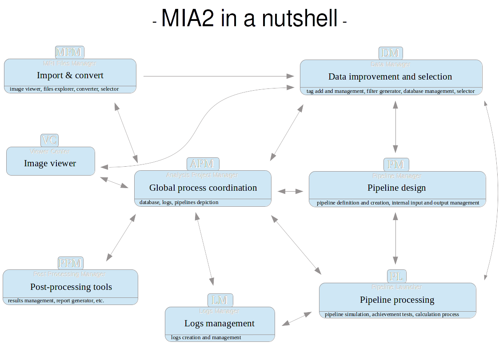

# Scope statement for MIA2
--------------------------

## What is MIA2?

MIA2 is shorthand for "Multiparametric Image Analysis - version 2". It is intended to be a complete image processing environment mainly targeted at the analysis and visualization of large amounts of MRI data.

MRI data analysis often requires a complex succession of data processing modules applied to a set of data acquired in an MRI exam or over several MRI exams. This analysis may need to be repeated a large number of times in studies involving a large number of acquisition sessions. Such that manual execution of the processing modules or simple ad-hoc scripting of the process may become error-prone, cumbersome and difficult to reproduce. Data processing modules exist in separate heterogeneous toolboxes, developed in-house or by other researchers in the field. This heterogeneity adds to the complexity of the modules are to be invoked manually.

MIA2 aims to provide easy tools to perform complex processing pipelines based on a definition of the inputs and outputs of the individual modules on a conceptual level, and implies identifying data with respect to their role in an analysis project: the scan type, the subject being scanned, the group this subject is part of etc.

## Definition of Terminology

### Data analysis project

A data analysis project is the collection of data, meta-data and processing pipeline necessary to extract a desired result from the data.

### Data

MIA2 is mainly intended to be used on MRI data. However, the use of other type of image or non-image data (MR spectroscopy, microscopy, EEG, physiologic parameters) should be handled wherever possible.
Raw data correspond to data available prior to initiating the data analysis project.
Derived data correspond to data generated by the data analysis project.

#### Data set

!!! TO CLARIFY !!!
A data set is one set of image (or non-image) data contained in one file and corresponding metadata such as from one MRI sequence or a map generated by a processing module. Often, an MRI sequence produces many images, which can have varying contrasts. The resulting images can be stored in the same file (representing data in up to 5 dimensions or more), or in separate files. As a result, depending on the context, one acquisition sequence can give rise to one data set or to several data sets.

#### Image

### Metadata

Metadata is data that accompany MRI (and other?) images and which do not define the pixel or voxel values. This includes information about image geometry, acquisition parameters, information about the sample (subject, age...) and about the role of the data in the current data analysis project (subject groups...).

### Pipeline

A pipeline is a simple or complex succession of calculations performed on (MR) images. Each calculation is performed by a processing module accessible from MIA2. In the simplest case, a pipeline is reduced to calling one processing module. A pipeline allows to define successions of modules, where the output (images and/or parameters) of some modules serve as inputs to other modules. Furthermore, MIA2 allows to define the inputs to modules in terms of meta-data of the data available (MRI scan type, subject name etc.). Conceptually, a pipeline can be regarded as one processing module with inputs and outputs, and can be part of a bigger pipeline.

### Processing modules

A processing module implements one processing step accessible from MIA2. A module takes zero or more images and zero or more parameters as inputs and produces zero or more images and zero or more parameters as output. This can be a very simple calculation on an image (multiplying an image by a number provided as a parameter), or a complex external processing tool (localizing and labeling all brain sulci in an structural MRI of a human brain).

### Data tags

Data tags allow to approach processing pipelines in a conceptual fashion: Define the input to processing modules based on tags. This happens on different levels. Tags can indicate what type of data is acceptable to a given processing module: A T2-fit may require multi-echo spin-echo (MSE) data. Tags also allow to define the role a given dataset plays in the data analysis project: Distinguish data from subjectA with respect to data from subjectB and loop an entire pipeline or part of a pipeline over subjects for example.

## Required Features

### Use cases

 * The user is acquiring MRI data. He or she needs to rapidly process recently acquired data to obtain informations necessary to continue the acquisitions. The software needs to allow to rapidly point to a file or dataset, to launch a processing module, to repeat the processing step on a different input dataset.
 * The user tests processing protocols: Back and forth between results and the definition of the processing pipeline. This process requires easy editing of the processing pipeline, user-friendly debugging (where did the process stop? why?), potentially sanity checks performed to detect errors in the pipeline even before launching it.
 * The user needs to apply a processing pipeline defined in advance: preparation of the pipeline, execution of a saved pipeline. This process requires logging of all of the actions performed by the pipeline (processing modules, software versions, parameters...).

### Feature list

 * Import MRI data in formats generated by all major MRI vendors into a data analysis project.
 * Convert MRI data on-the-fly between the most common format to call processing modules requiring a specific format as input or providing data in a specific format as output.
 * Log the activity of the processing modules called in a pipeline. Provide software version, input parameters and images, output parameters, dateťime, run time, messages generated by the processing modules.

## Desirable Features

 * Resuming a processing pipeline that has been aborted or has crashed from where it stopped
 * Repeat a pipeline after modification while avoiding to repeat processing steps that have already been performed and not changed ("make").
 * Reproduce a pipeline from a log

## Implementation constraints

### Programming language

Python3

## Software architecture

The software will be divided into separate blocks. Some of these modules correspond to blocks that are visible to the user as separate tabs in the user interface. Some of the  provide the underlying functionality and are separated from the rest of the software via well defined APIs for ease of development and maintenance.

### User accessible tabs

 * `Data converter / import`:
    This tab is essentially a link to "MRI file manager". The MRI file manager allows rapid visualization and conversion of MRI data. The user selects the data to be converted / imported, defines (or uses the default) destination folder, defines (or uses the default) file naming convention, and the converter places the converted files at the specified location.

 * `Data viewer`:
    An advanced viewer of up to 5-dimensional data, mostly but not exclusively MRI data, spectra,  plots linked to image and non-image data (e.g. one pixel of an image over time, values of several ROIs across parameter maps, correlations between pixel intensities of two maps, physiological parameter over time), with the possibility to show in parallel or overlay several data sets, draw ROIs...
    > JW: Maybe this should be independent?

 * `Data browser / Tag manager`:
    Provides an overview of the data (image or non-image) available in the current analysis project (raw data and derived data). Data browser.
    
    * Configure overview of the meta-data (from acquisition or added by the user)
    * Visualize the corresponding images in a simple and fast way (different from the data viewer above)
    * Define, edit, load and store user-defined tags
    * Overwrite values of tags imported from the raw data
    * Select tags and the statistics on the numbers of occurrences of selected tags: How many subjects in group A? How many time points for subjectB?
    * Select individual or multiple datasets for various operations: 
       * Edit data tags of all selected data sets Define common values for a given data tag
       * Derive (or assist in deriving) a filter from the selection for use in a processing pipeline
       Selection can be either by selecting in the data browser using a mouse pointer or keyboard (following a single or multi-column sorting), or by defining filters (i.e. queries) on the tags.     
       
 * `Rapid data processing / prototyping`:
    Defines a simple processing step for 'live' usage (use during acquisitions next to the MRI console). The user selects a dataset accessible to the software and defines and executes a processing module: choice of the file (or tag), choice of the processing module (easy to browse list of available modules), choice of the processing parameters, choice of output options (visualization, file, database) and definition of tags for the generated images.

 * `Definition of a processing pipeline`:
    * Usage via input filters on the data tags
    * 'Live' usage on input files
    * Access to the list of available bricks, with a mean to access the details of each brick (input / output parameters and related documentation, possibly with examples)
    * Pipeline definition in a script mode
    * Graphical visualization of the main characteristics of the pipeline:
        * Possibility to visualize (thumbnails of) images with their tags to make user interaction more visual
        * Access to detailed informations about each brick
        * Possibility to do some basic editing on the brick properties, on the link between bricks
    * Addition of a brick will lead to a basic simulation of that processing step and add virtual data to the database, so that these virtual data become available for future bricks of the pipeline
    
    Construction of a processing pipeline constituted of a succession or juxtaposition of processing modules. Possibility of loops. Possibility of filters based on data tags at the inputs of processing modules. Exceptions in loops?
    
    Possibility to save / export the processing pipeline (JSON) for use on a different machine / different project / later work on this project

 * `Running a processing pipeline`:
    * Configure the execution of one or several pipeline
    * Possibility to perform a detailed simulation of the pipeline execution, to prepare an execution of the pipeline across multiple processors.
    * Start / stop the execution of a pipeline
    * Monitor the execution of a pipeline (e.g. number of remaining steps, number of generated datafile vs number of expected data files)

 * `Activity log`:
    * Access to the history all the executed command. This history should correspond to the simulated pipeline prior to its execution. This history should be editable so that it can be executed?  
 

 * `Brick manager tab`:
    * List all available brick
    * Edit the documentation about each brick
    * Add/Delete brick

### Underlying libraries

## Existing features and libraries

### Third party libraries

#### nipype

#### CAPSUL

#### Visualization of a processing pipeline

Take design ideas from scractch, LabView, Icy

### Features implemented locally

#### Data conversion

#### Tagging Data

In order to allow subsequent links to different representations of data for example
in a database, it will be necessary to allow for tags to be identified as to the 
type of information they contain (e.g. 'TR' is an acquisition parameter; 'Age' is
information on the subject) to allow for the implementation of export routines,
for example for processing results, to external data repositories.

#### Implementation of filters on the existing data

These filters are required at several levels:
 * The input to a pipeline may need to be limited to a subset of the available data.
   Such a selection may be performed manually or via a saved filter applied to 
   the data prior to launching the pipeline on the subset of data selected.
 * An entire pipeline or individual modules of a pipeline may need to restrict the
   data they take as inputs (for example only data from a multi-spin-echo MRI
   sequence in a module calculating T2).
 * A selection of entries is necessary to perform manual tagging of the data, and
   such a selection may be facilitated by filters. Filters are required to implement
   automatic tagging of data.

The implementation of the filtering needs to be very well abstracted from the implementation
of the rest of the pipeline, such that it is easy to replace the implementation by
a different one, if more complex requests become necessary. Similarly, abstracting 
the filter implementation may allow to modify the underlying representation
of the queried meta-data, should that become necessary (e.g. database instead of 
python dictionary).

#### Class layout

Simon Loury has proposed an implementation of a class structure for this project,
following discussion of our needs. The code is under src/old/MIA2_simon.

# Cahier des charges par EB, PG, OM - parties non-encore intégrées dans le document en anglais

1/ L'utilisateur démarre le logiciel : que voit-il ? Que peut-il faire ?

- créer / ouvrir un nouveau projet d'analyse : cette page blanche sert à loger les actions de l'utilisateur dans la sessions et à stocker les informations relatives au projet (hiérarchie, étiquettes, protocole d'analyse…)
	Cette action crée un répertoire (du nom du projet) qui contient le fichier xml/json de log, les données Nifti/json (issue de la conversion des données brutes)(Si travail avec BDD, alors simplement un lien vers les données Nifti/json de la BDD.), et les fichiers des données traitées. 

- navigateur pour parcourir les données sources :
	- données sous forme de fichiers sur le disque : données brutes à convertir, données Nifti/json
		navigateur enrichi avec affichage des paramètres d'acquisition essentiels du fichier (choix des paramètres à afficher modifiable), affichage adapté à la structure des données parcourues (ex. Bruker, Par/Rec...), 
		fonction dans le navigateur permettant d'ajouter des metadatas sur une sélection de fichiers : dans un premier temps champ texte qui permettrait de noter des infos type cahier de manip / pointeur vers un doc de cahier manip (json)
		Dans le navigateur, possibilité de faire des sélections de fichiers multiples, des requêtes sur la base d'éléments du nom de fichier/des paramètres d'acquisition/des métadatas

	- données stockées dans une base de données type Shanoir

> EC: to lighten and add ASAP to the english text above

	

