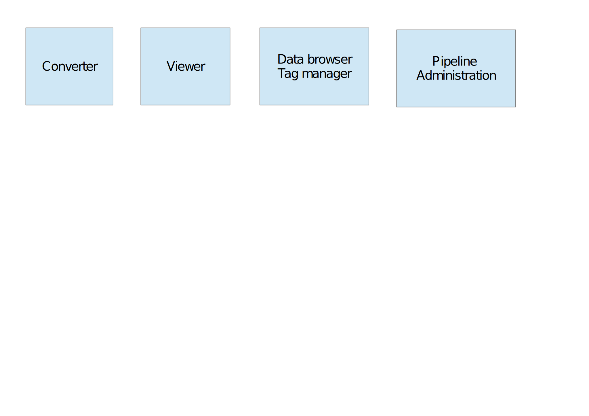

# Scope statement for MIA2
--------------------------

## What is MIA2?

## Definition of Terminology

### Data analysis project

### Data

### Metadata

### Pipeline

### Processing modules

### Data tags

## Required Features

## Desirable Features

## Implementation constraints

### Programming language

## Existing features and libraries

### Third party libraries

#### nipype

#### CAPSUL

### Features implemented locally

#### Data conversion

#### Tagging Data

#### Class layout