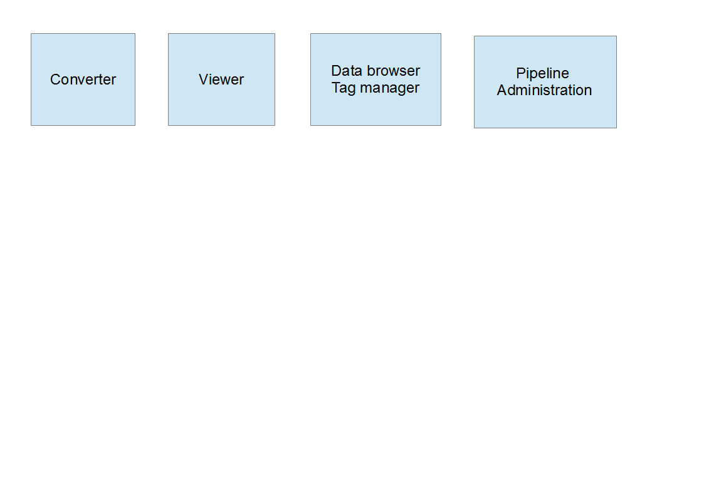

# Scope statement for MIA2
--------------------------

## What is MIA2?

## Use cases

 * The user is acquiring MRI data. He or she needs to rapidly process recently acquired data to obtain informations necessary to continue the acquisitions. The software needs to allow to rapidly point to a file or dataset, to launch a processing module, to repeat the processing step on a different input dataset.
 * The user tests processing protocols: Back and forth between results and the definition of the processing pipeline. This process requires easy editing of the processing pipeline, user-friendly debugging (where did the process stop? why?), potentially sanity checks performed to detect errors in the pipeline even befoure launching it.
 * The user needs to apply a processing pipeline defined in advance: preparation of the pipeline, execution of a saved pipeline. This process requires logging of all of the actions performed by the pipeline (processing modules, software versions, parameters...).

## Definition of Terminology

### Data analysis project

### Data

#### Data set

#### Image

### Metadata

### Pipeline

### Processing modules

### Data tags

Data tags allow to approach processing pipelines in a conceptual fashion: Define the input to processing modules based on tags. This happens on different levels. Tags can indicate what type of data is acceptable to a given processing module: A T2-fit may require multi-echo spin-echo (MSE) data. Tags also allow to define the role a given dataset plays in the data analysis project: Distinguish data from subjectA with respect to data from subjectB and loop an entire pipeline or part of a pipeline over subjects for example.

## Required Features

### Data formats

## Desirable Features

## Implementation constraints

### Programming language

## Software architecture

The software will be divided into separate blocks. Some of these modules correspond to blocks that are visible to the user as separate tabs in the user interface. Some of the  provide the underlying functionality and are separated from the rest of the software via well defined APIs for ease of development and maintenance.

### User accessible tabs

 * Data converter / import
    This tab is essentially a link to "MRI file manager". The MRI file manager allows rapid visualization and conversion of MRI data. The user selects the data to be converted / imported, defines (or uses the default) destination folder, defines (or uses the default) file naming convention, and the converter places the converted files at the specified location.

 * Data viewer
    An advanced viewer of up to 5-dimensional data, mostly but not exclusively MRI data, with the possibility to show in parallel or overlay several data sets, draw ROIs...
    Maybe this should be independent?

 * Data browser
    Provides an overview of the data available in the current analysis project. Data browser. 
    * Configure overview of the meta-data (from acquisition or added by the user)
    * Visualize the corresponding images in a simple and fast way
    * Define, edit, load and store user-defined tags
    * Overwrite values of tags imported from the raw MRI data
    * Show statistics on the numbers of occurrences of selected tags: How many subjects in group A? How many time points for subjectB?
    * Select individual or multiple datasets for various operations: 
       * Edit data tags of all selected data sets Define common values for a given data tag
       * Derive (or assist in deriving) a filter from the selection for use in a processing pipeline
       Selection can be either by selecting in the data browser using a mouse pointer or keyboard, or by defining filters on the tags.       
       
 * Rapid data processing / prototyping
    Defines a simple processing step for 'live' useage (use during acquisitions next to the MRI console). The user selects a dataset accessible to the software and defines and executes a processing module: choice of the file (or tag), choice of the processing module (easy to browse list of available modules), choice of the processing parameters, choice of output options (visualization, file, database) and definition of tags for the generated images.

 * Definition of a processing pipeline
    * Useage via input filters on the data tags
    * 'Live' useage on input files
    Construction of a processing pipeline constituted of a succession or juxtaposition of processing modules. Possibility of loops. Possibility of filters based on data tags at the inputs of processing modules. Exceptions in loops?
    Possibility to save / export the processing pipeline (JSON) for use on a different machine / different project / later work on this project
    Graphical visualization of the processing pipeline
Protocols), scilab (scicos). Possibilité d'afficher des images avec leur étiquette pour rendre la programmation plus graphique encore
    
### Underlying libraries

## Existing features and libraries

### Third party libraries

#### nipype

#### CAPSUL

#### Visualization of a processing pipeline
Take design ideas from scractch, LabView, Icy

### Features implemented locally

#### Data conversion

#### Tagging Data

#### Class layout

1/ L'utilisateur démarre le logiciel : que voit-il ? Que peut-il faire ?

- créer / ouvrir un nouveau projet d'analyse : cette page blanche sert à loger les actions de l'utilisateur dans la sessions et à stocker les informations relatives au projet (hiérarchie, étiquettes, protocole d'analyse…)
	Cette action crée un répertoire (du nom du projet) qui contient le fichier xml/json de log, les données Nifti/json (issue de la conversion des données brutes)(Si travail avec BDD, alors simplement un lien vers les données Nifti/json de la BDD.), et les fichiers des données traitées. 

- navigateur pour parcourir les données sources :
	- données sous forme de fichiers sur le disque : données brutes à convertir, données Nifti/json
		navigateur enrichi avec affichage des paramètres d'acquisition essentiels du fichier (choix des paramètres à afficher modifiable), affichage adapté à la structure des données parcourues (ex. Bruker, Par/Rec...), 
		fonction dans le navigateur permettant d'ajouter des metadatas sur une sélection de fichiers : dans un premier temps champ texte qui permettrait de noter des infos type cahier de manip / pointeur vers un doc de cahier manip (json)
		Dans le navigateur, possibilité de faire des sélections de fichiers multiples, des requêtes sur la base d'éléments du nom de fichier/des paramètres d'acquisition/des métadatas

	- données stockées dans une base de données type Shanoir

	

