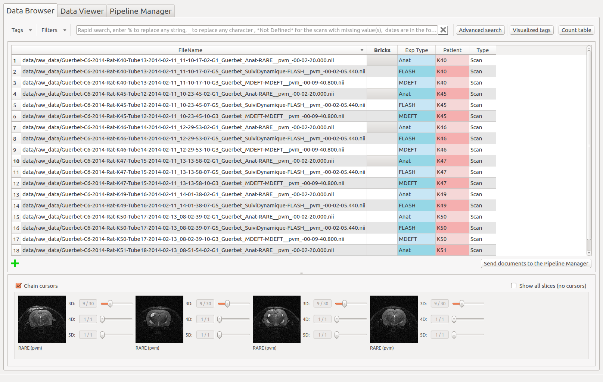
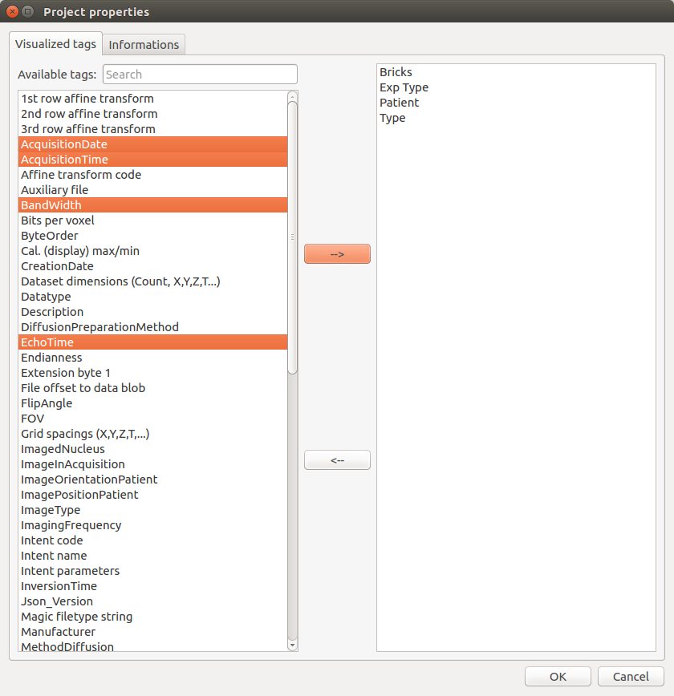
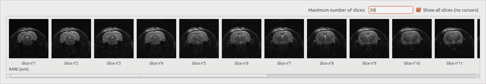
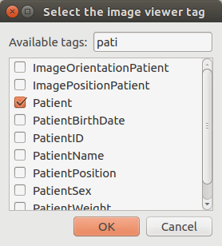
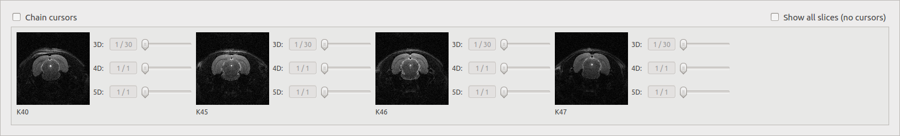

.. toctree::

+-----------------------+---------------------------------------+---------------------------------------------------+--------------------------------------------------+
|`Home <../index.html>`_|`Documentation <./documentation.html>`_|`Installation <../installation/installation.html>`_|`GitHub <https://github.com/populse/populse_mia>`_|
+-----------------------+---------------------------------------+---------------------------------------------------+--------------------------------------------------+

Populse_MIA's Data Browser
==========================

This page is a user guide for Populse_MIA's Data Browser, a tool to communicate with the current project's database.

Tab presentation
----------------

The Data Browser tab is composed of three main elements:
  * A toolbar on the top which contains tools to interact with the database 
  * A table which displays the content of the database
  * An image viewer which displays the files contained in the database

Here is an overview of the Data Browser tab:

The toolbar
------------

The toolbar contains several actions to interact with the database which are listed below.

Add tag (from "Tags" menu, shortcut: Ctrl+A)
^^^^^^^^^^^^^^^^^^^^^^^^^^^^^^^^^^^^^^^^^^^^
Add a tag for all the documents in the database, specifying its name (mandatory), its default value, a short description, its unit and its type.

.. image:: ../images/add_tag.png
   :align: center
   :name: Add tag pop-up

Clone tag (from "Tags" menu)
^^^^^^^^^^^^^^^^^^^^^^^^^^^^
Copy an existing tag to another name for all the documents in the database.

.. image:: ../images/clone_tag.png
   :align: center
   :name: Clone tag pop-up

Remove tag (from "Tags" menu)
^^^^^^^^^^^^^^^^^^^^^^^^^^^^^
Remove a cloned or added tag for all the documents in the database.

.. image:: ../images/remove_tag.png
   :align: center
   :name: Remove tag pop-up

Save the current filter (from "Filters" menu)
^^^^^^^^^^^^^^^^^^^^^^^^^^^^^^^^^^^^^^^^^^^^^
Save to a json file the content of the current filter in the rapid or advanced search. This file is stored in the "filters" folder of the current project.

.. image:: ../images/save_filter.png
   :align: center
   :name: Save filter pop-up

Open a filter (from "Filters" menu)
^^^^^^^^^^^^^^^^^^^^^^^^^^^^^^^^^^^
Open a filter contained in the "filters" folder of the current project.

.. image:: ../images/open_filter.png
   :align: center
   :name: Open filter pop-up

Visualized tags
^^^^^^^^^^^^^^^
Update the tags that are visualized in the table, which can also be changed in the Project properties. 

The widget is composed of two lists. The one on the left contains the tags of the database that are not displayed in the table. To make one tag visible, select it in the list and press on the middle cross "-->" to pass it to the list on the right, that contains the visualized tags. Save your changes by pressing "OK". 

Count table
^^^^^^^^^^^
Count and verify the scans in the current project. 

It is composed of push buttons on its top, each one corresponding to a tag selected by the user.
When, the "Count scans" button is clicked, a table is created with all the combinations possible
for the values of the first n-1 tags. Then, the m values that can take the last tag are displayed
in the header of the m last columns of the table. The cells are then filled with a green plus or
a red cross depending on if there is at least a scan that has all the tags values or not.

Example 1:

In this case, by setting the first tag to "Patient" and the second to "Exp Type", it is possible to see that the MDEFT scan for Patient K49 and the FLASH scan for Patient K51 are missing, which could be problematic for the follow-up of the analysis.

.. image:: ../images/count_table.png
   :align: center
   :name: Count table pop-up

Example 2:

Assume that the current project has scans for two patients (P1 and P2) and three time points (T1,
T2 and T3). For each (patient, time point), several sequences have been made (two RARE, one MDEFT
and one FLASH). Selecting [PatientName, TimePoint, SequenceName] as tags, the table will be:

+-------------+-----------+------+-------+-------+
| PatientName | TimePoint | RARE | MDEFT | FLASH |
+=============+===========+======+=======+=======+
| P1          | T1        | v(2) | v(1)  | v(1)  |
+-------------+-----------+------+-------+-------+
| P1          | T2        | v(2) | v(1)  | v(1)  |
+-------------+-----------+------+-------+-------+
| P1          | T3        | v(2) | v(1)  | v(1)  |
+-------------+-----------+------+-------+-------+
| P2          | T1        | v(2) | v(1)  | v(1)  |
+-------------+-----------+------+-------+-------+
| P2          | T2        | v(2) | v(1)  | v(1)  |
+-------------+-----------+------+-------+-------+
| P2          | T3        | v(2) | v(1)  | v(1)  |
+-------------+-----------+------+-------+-------+
with v(n) meaning that n scans corresponds of the selected values for (PatientName, TimePoint,
SequenceName).

If no scans corresponds for a triplet value, a red cross will be displayed. For example, if you forget to import one RARE for P1 at T2 and one FLASH for P2 at T3. The table will be:

+-------------+-----------+------+-------+-------+
| PatientName | TimePoint | RARE | MDEFT | FLASH |
+=============+===========+======+=======+=======+
| P1          | T1        | v(2) | v(1)  | v(1)  |
+-------------+-----------+------+-------+-------+
| P1          | T2        | v(1) | v(1)  | v(1)  |
+-------------+-----------+------+-------+-------+
| P1          | T3        | v(2) | v(1)  | v(1)  |
+-------------+-----------+------+-------+-------+
| P2          | T1        | v(2) | v(1)  | v(1)  |
+-------------+-----------+------+-------+-------+
| P2          | T2        | v(2) | v(1)  | v(1)  |
+-------------+-----------+------+-------+-------+
| P2          | T3        | v(2) | v(1)  | x     |
+-------------+-----------+------+-------+-------+

Thus, thanks to the CountTable tool, you directly know if some scans are missing.

Rapid search
^^^^^^^^^^^^
Search for a pattern in the table (for all the visualized tags).

Enter `%` to replace any string, `_` to replace any character , `*Not Defined*` for the scans with missing value(s). Dates are in the following format: yyyy-mm-dd hh:mm:ss.fff"

Rapid search example:

.. image:: ../images/rapid_search.png
   :align: center
   :name: Rapid search example

Advanced search
^^^^^^^^^^^^^^^
Create a complex filter to extract the information in the table.

The advanced search creates a complex query to the database and is a combination of several "query lines" which are linked with AND or OR and all composed of:
  * A negation or not
  * A tag name or all visible tags
  * A condition (==, !=, >, <, >=, <=, CONTAINS, IN, BETWEEN) 
  * A value

Advanced search example:

.. image:: ../images/advanced_search.png
   :align: center
   :name: Advanced search example

The table
---------

The table displays the documents contained in the database and their associated tags. Some information about it:

  * Any cell can be selected and modified (except the FileName column). 
  * To select several cells, drag onto them or use Ctrl or Shift. 
  * A red cell means that the tag is a cloned or a user tag.
  * A blue cell means that the original value of the tag has been modified.
  * To sort the table depending a column, click one time on its header.
  * To select an entire column, double click on its header.

By right clicking in the table, a sub-menu is displayed and contains action to apply on the selected cells. These actions are listed below.

Reset cell(s)
^^^^^^^^^^^^^
Reset the selected cells to their original values.

Reset column(s)
^^^^^^^^^^^^^^^
Reset the selected columns to their original values (no need to select the entire column).

Reset row(s)
^^^^^^^^^^^^
Reset the selected rows to their original values (no need to select the entire row).

Clear cell(s)
^^^^^^^^^^^^^
Set the `*Not Defined*` value to the selected cells.

Add document
^^^^^^^^^^^^
Add a document to the database. This action can also be done using the green cross on the bottom left of the bottom left of the table.

.. image:: ../images/add_document.png
   :align: center
   :name: Add document example

Remove document(s)
^^^^^^^^^^^^^^^^^^
Remove the selected documents from the database.

Select column(s)
^^^^^^^^^^^^^^^^
Select the entire column.

Multiple sort
^^^^^^^^^^^^^
Sort the table on several tag values, in an ascending or descending way.

Example:

Sorting the table in a descending way, for all the Exp Type values and then the Patient values.

.. image:: ../images/multiple_sort.png
   :align: center
   :name: Multiple sort example

The table is now sorted depending on the Exp Type tag, in a descending way. For a same Exp Type value, the documents are sorted depending the Patient values, in a descending way too.

.. image:: ../images/multiple_sort_result.png
   :align: center
   :name: Multiple sort result example

Send documents to the Pipeline Manager
^^^^^^^^^^^^^^^^^^^^^^^^^^^^^^^^^^^^^^
Use the selected documents to the Pipeline Manager.

A pop-up is displayed to confirm the selected documents. Click on "OK" to use these documents in the follow-up of the analysis.

.. image:: ../images/send_to_pipeline.png
   :align: center
   :name: Send documents to pipeline example

The image viewer
----------------

The Data Browser's image viewer is a simple tool to display MRI data contained in the database. It can be hidden using the splitter. The selected document(s) (up to 4) in the table are displayed. Several options are available and are described below.

Chain cursors
^^^^^^^^^^^^^
When several documents are selected, moving a cursor moves the same cursors on all the images.

Image viewer with chained cursors:

.. image:: ../images/chain_cursors.png
   :align: center
   :name: Chain cursors example

Image viewer with unchained cursors:

.. image:: ../images/no_chain_cursors.png
   :align: center
   :name: No chain cursors example

Show all slices
^^^^^^^^^^^^^^^
Display slices of a selected file (work with only one document) depending on the dimension of the image. The number of displayed slices can be modified.

  * 3D: display all the slices.
  * 4D: display the middle slice of the third dimension for each time of the fourth dimension.
  * 5D: display the middle slice of the third dimension for the first time of the fourth dimension for each time of the fifth dimension.

Change the visualized tag
^^^^^^^^^^^^^^^^^^^^^^^^^
By clicking on the label below the images, it is possible to change the tag that is visualized in the image viewer. By default, it is set to SequenceName.

The visualized tag has been updated in the image viewer:

