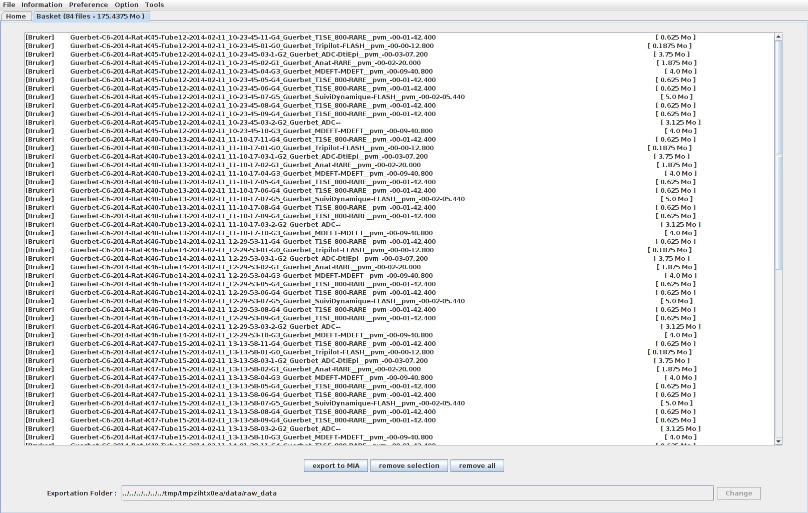

.. :orphan: is used below to try to remove the following warning: checking consistency... /home/econdami/Git_Projects/populse_mia/docs/source/documentation/mri_file_manager.rst: WARNING: document isn't included in any toctree

   :orphan:
   
.. toctree::

+-----------------------+---------------------------------------+---------------------------------------------------+--------------------------------------------------+
|`Home <../index.html>`_|`Documentation <./documentation.html>`_|`Installation <../installation/installation.html>`_|`GitHub <https://github.com/populse/populse_mia>`_|
+-----------------------+---------------------------------------+---------------------------------------------------+--------------------------------------------------+

MRI File Manager documentation
==============================

This page is a user guide for the MRI File Manager, in the context of mia. More detailed documentation is available with the executables codes of the mri_conv_ software, hosted in the Populse project.

To launch this Populse third party software and import MRI data to the current analysis project, select the "Import" action of the "File" menu.

|

.. image:: ../images/mri_file_manager_1.png
   :align: center
   :name: MRIFileManager1

|

* Depending on the data you want to convert, click on "Bruker", "Dicom", "Philips Achieva" or "NifTI" on the top of the software to browse to the files.

* All the scans of your study are now stored in the table and you can visualize them by clicking "Show image preview" under the "Preference" menu.

|

.. image:: ../images/mri_file_manager_2.png
   :align: center
   :name: MRIFileManager2

|

* Select the scans you want to export and send them to the basket by right-clicking and select "Add to basket" or "Add all sequences to basket" (shortcut: Ctrl+B or Ctrl+Maj+B)

* Move to the "Basket" tab to verify the files you want to export to Populse_MIA.

|

|

* Click on "Export to MIA". A log message is displayed before exiting MRI File Manager.

|

.. image:: ../images/mri_file_manager_4.png
   :align: center
   :name: MRIFileManager4

|

* The selected scans are then stored in the database of the current analysis project and display in the Data Browser of Populse_MIA.

|

.. image:: ../images/mri_file_manager_5.png
   :align: center
   :name: MRIFileManager5

.. _mri_conv: https://github.com/populse/mri_conv
