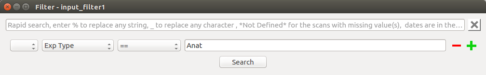
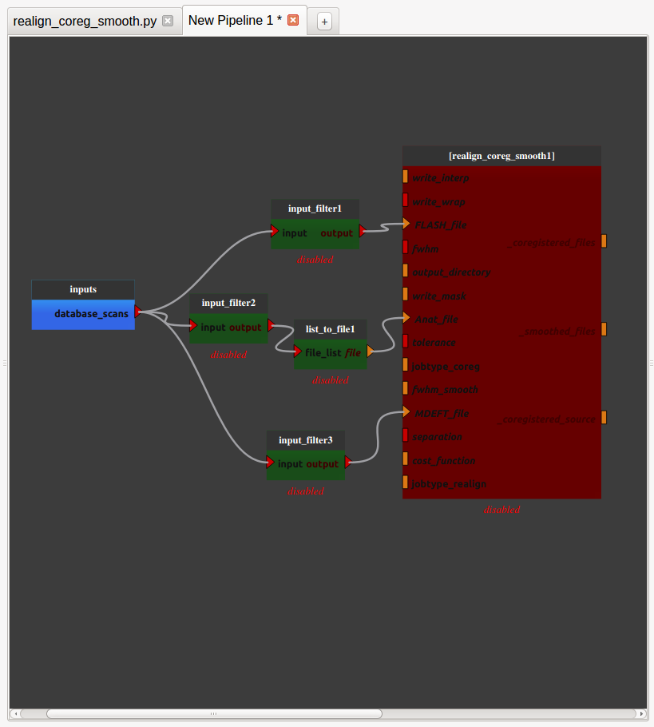
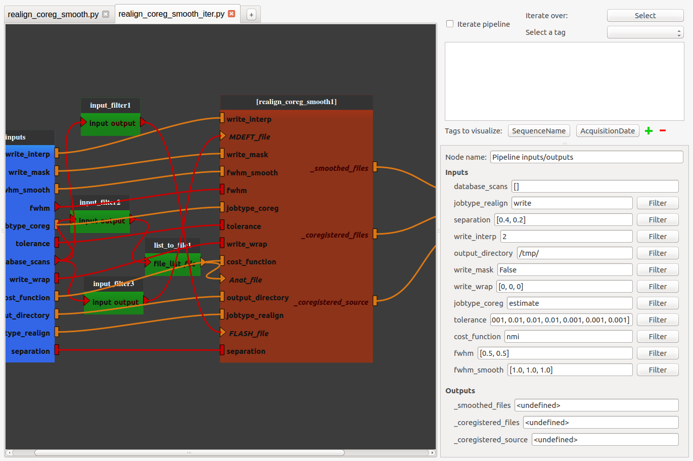

.. toctree::

+-----------------------+---------------------------------------+---------------------------------------------------+--------------------------------------------------+
|`Home <../index.html>`_|`Documentation <./documentation.html>`_|`Installation <../installation/installation.html>`_|`GitHub <https://github.com/populse/populse_mia>`_|
+-----------------------+---------------------------------------+---------------------------------------------------+--------------------------------------------------+

A pipeline example with Populse_MIA's
=====================================

This page gives a concrete example on how to create pipelines and how to iterate them correctly in Populse_MIA.

The data
--------

Assume that the current project contains this data:

.. image:: ../images/data_browser.png
   :align: center
   :name: Data Browser

Note: thanks to the `Count Table <./data_browser.html#count-table>`_, we know that they are some missing files for patients K49 and K51. For the other patients, three "Exp Type" are available : Anat, FLASH and MDEFT.

Requirements specification of the pipeline
------------------------------------------

The pipeline that will be created will :

  * Use SPM's processes
  * Iterate over each patient of the project
  * Realign the FLASH scan
  * Coregister the realigned FLASH scan with the Anat scan
  * Smooth the MDEFT scan

Pipeline creation
-----------------

* First add the three SPM's processes by dragging them from the process library (under nipype > interfaces > spm) and dropping them to the pipeline editor.

.. image:: ../images/pipeline_example_1.png
   :align: center
   :name: Pipeline example 1

|

* Export the plugs that you want to be able to modify from outside the pipeline and add links between the realign and coregister nodes (`more information <./pipeline_manager.html#how-to-use-the-pipeline-editor>`_)

    * The Realign process jobtype will be "write" so the output of the node will be a new file that will be contained in the "_realigned_files" plug.
    * We will also choose to create the mean image of the FLASH scan. It will be contained in the '_mean_image' file.
    * The "target" of the Coregister process is the reference file to register to. In this case, this is the 3D Anat file.
    * The "source" of the Coregister process is the file to register to the target. In this case, this will be the FLASH scan's mean image.
    * The transformation from "source" to "target" will be applied to "apply_to_files" which is, in this case, the realigned FLASH scan.

.. image:: ../images/pipeline_example_2.png
   :align: center
   :name: Pipeline example 2

|

* Save the pipeline in the proposed folder by clicking on the bottom left "Pipeline" menu. It is now stored in the process library under "User_processes".

.. image:: ../images/pipeline_example_3.png
   :align: center
   :name: Pipeline example 3

Pipeline iteration
------------------

To be able to iterate the pipeline correctly, you will need a filter process that is only available in the MIA_processes packages that is not included in the original software. 

If you want to have access to this special package, ask a Populse organization member. 

Once you have downloaded the "MIA_processes" package, to install it, go to More > Install processes > From folder in Populse_MIA's menu bar and browse to the package. Click on “Install package”. The package is then stored in the process library.

* Add the previously saved pipeline in a new editor by dragging it from the process library (under User_processes) and dropping it to the pipeline editor.

.. image:: ../images/pipeline_example_4.png
   :align: center
   :name: Pipeline example 4

|

* Add Input_filter processes in front of each input that comes from the database (Anat_file, FLASH_file and MDEFT_file)
    * Note: a file_to_list process is added before the Anat_file plug because Input_filter's output is of type List, and Anat_file plug is of type File.

.. image:: ../images/pipeline_example_5.png
   :align: center
   :name: Pipeline example 5

|

* For each Input_filter process, right-click on it and select "Open filter". In the filter pop-up, modify the filter to apply.
    * For exemple, for the Anat_file plug. Set : "Exp Type == Anat" in the Advanced Search.

|

* Right-click on one of the Input_filter processes and select "Export to database_scans".

* Add links between "database_scans" and the input of the other Input_filter processes.

|

* Export the other node plugs by right-clicking on "realign_coreg_smooth1" node and selecting "Export all unconnected plugs".
    * The pipeline becomes enabled.

.. image:: ../images/pipeline_example_8.png
   :align: center
   :name: Pipeline example 8

|

* Save the pipeline in the proposed folder by clicking on the bottom left "Pipeline" menu.

* Click on the "inputs" or "outputs" node and modify the parameters in the node controller

|

* Save the set of parameters that you have just modified by clicking on "Save pipeline parameters" in the bottom left "Pipeline" menu.
    * This step is not mandatory. But by saving these parameters, the next time you open the pipeline, you will be able load them directly by clicking on "Load pipeline parameters" in the bottom left "Pipeline" menu.

* Set up the iteration table.
    * Check the "Iterate pipeline" check box and select to iterate over the "Patient" tag.
    * By changing the value of the selected Patient, you change the list of documents in "database_scans"

.. image:: ../images/pipeline_example_10.png
   :align: center
   :name: Pipeline example 10

|

* Run the pipeline by clicking on "Run pipeline" in the bottom left "Pipeline" menu.
    * Choose on which Patient to iterate the pipeline (reminder: patients K49 and K51 got missing files)
    * In iteration mode, there is no need to initialize the pipeline. It is automatically done before each iterated run.

.. image:: ../images/pipeline_example_11.png
   :align: center
   :name: Pipeline example 11

|

* During the run, some information is displayed thanks to the status bar at the bottom of the software.

.. image:: ../images/pipeline_example_12.png
   :align: center
   :name: Pipeline example 12

|

* At the end of the run, another message to sum-up the run is displayed thanks to the status bar at the bottom of the software.

.. image:: ../images/pipeline_example_13.png
   :align: center
   :name: Pipeline example 13
