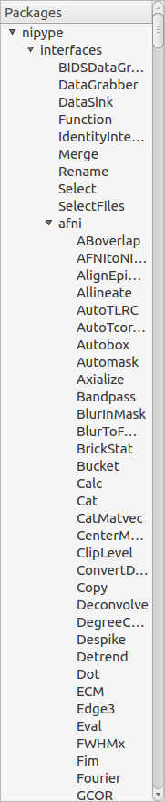
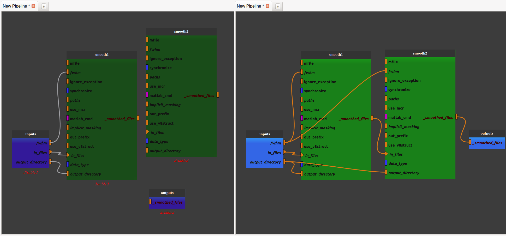
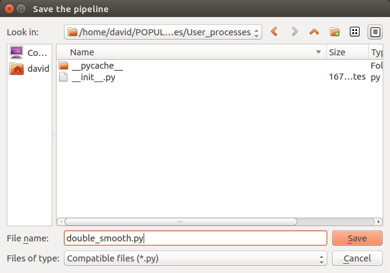
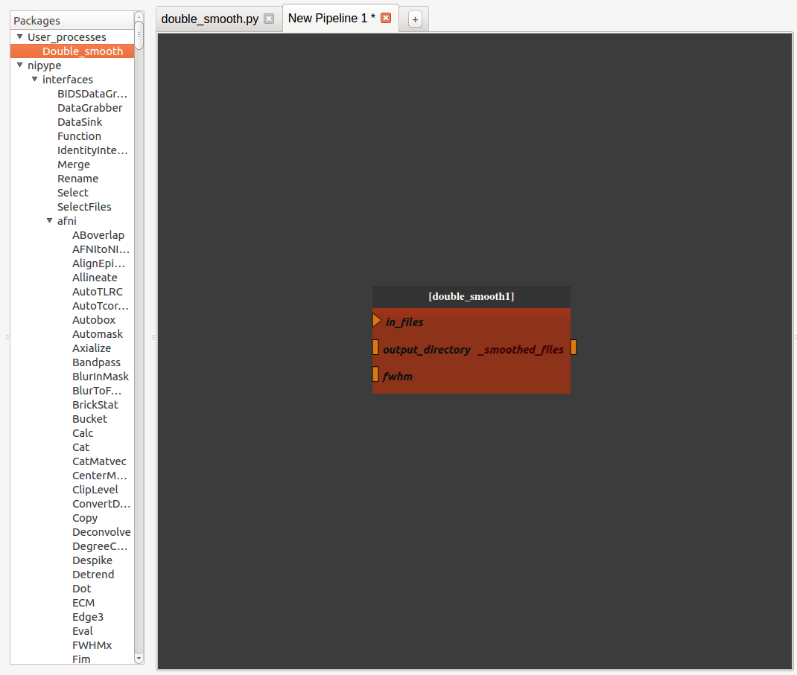
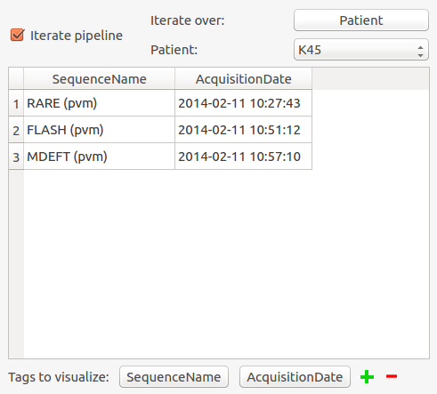
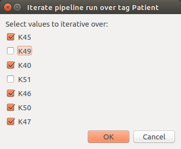

.. toctree::

+-----------------------+---------------------------------------+---------------------------------------------------+--------------------------------------------------+
|`Home <../index.html>`_|`Documentation <./documentation.html>`_|`Installation <../installation/installation.html>`_|`GitHub <https://github.com/populse/populse_mia>`_|
+-----------------------+---------------------------------------+---------------------------------------------------+--------------------------------------------------+

Populse_MIA's Pipeline Manager
==============================

This page is a user guide for Populse_MIA's Pipeline Manager, a tool to build and run processing pipelines in a graphical way.

Tab presentation
----------------

The Pipeline Manager tab is composed of four main elements:
  * :ref:`process-library-label`
  * :ref:`pipeline-editor-label`
  * :ref:`iteration-table-label`
  * :ref:`node-controller-label`

Here is an overview of the Pipeline Manager tab:

.. image:: ../images/pipeline_manager.png
   :align: center
   :name: Pipeline Manager tab

.. _process-library-label:

The process library
-------------------

The process library contains all the available pipeline processes. 

When Populse_MIA is launched for the first time, Nipype's interfaces are stored in the process library.

To use any of the available processes, drag it from the process library and drop it to the pipeline editor.

When a pipeline is saved, it is stored in the process library under "User_processes" and can be used as a process.

Here is an overview of the process library:

.. _pipeline-editor-label:

The pipeline editor
-------------------

The pipeline editor is a graphical tool to create pipelines. It is composed of several tabs to work on several pipelines at the same time. In the following, the current tab will be called "current editor".

The menu on the top left of the Pipeline Manager tab contains several actions impacting the current editor:

  * Load pipeline
      * Loads a saved pipeline in a new editor (or in the current editor if there is only one editor and it is empty)
  * Save pipeline
      * Saves the pipeline of the current editor
  * Load pipeline parameters
      * Loads a parameters set and apply them to the pipeline global inputs/outputs
  * Save pipeline parameters
      * Saves the pipeline global inputs/outputs to a json file
  * Initialize pipeline
      * Creates the output file names for each process in the current pipeline and stores them to the database
      * For the processes that interact with the database, verifies that the fields are filled
  * Run pipeline
      * Executes the current pipeline

How to use the pipeline editor
^^^^^^^^^^^^^^^^^^^^^^^^^^^^^^

The pipeline edtior uses the PipelineDevelopperView tool from `Capsul <http://brainvisa.info/capsul/index.html>`_ to create pipelines in a graphical way. Here is a tutorial to help you create and save a simple pipeline (no initialization and no run):

- Add a SPM smooth process by dragging it from the process library and dropping it into the pipeline editor

.. image:: ../images/pipeline_tuto_1.png
   :align: center
   :name: Pipeline tutorial 1

- Export the input and output plug(s) you want to be able to modify by right-clicking on them and click on "export plug", rename it if you want and click on "OK". 

Note 1: a plug is either mandatory or optional. When it is mandatory, it is represented as a triangle and has to be exported or connected to another plug to run the pipeline. When it is optional, it is represented as a rectangle and can be exported or connected or not. Usually optional plugs have default values, e.g. "fwhm" plug from SPM's smooth is [6, 6, 6], so do not need to be exported and/or modified. It all depends if you want to have access to this plug when the pipeline will be used as a process.

Note 2: to make a pipeline valid, you have to export plugs that are the pipeline global input/outputs. In this example, the "in_files" plug needs to be exported because it is mandatory. The only output plug has to be also exported. The node will then be activated and its color become lighter. It is also possible to export optional plug such as "fwhm" and "output_directory" even if they already have default value.

Note 3: Nipype's processes in Populse_MIA need an "output_directory" plug value to be run. It is important to always export it and to set it (e.g. "/tmp/"). 

Note 4: if you right-click on a node or on the pipeline editor background, you can also export plugs (mandatory or not, input, output or both). This method is usually faster to export plugs. 

.. image:: ../images/pipeline_tuto_2.png
   :align: center
   :name: Pipeline tutorial 2

Now the pipeline is only composed of one process with exported inputs/output. It is still possible to add another process to modify it. 

- Add another SPM smooth process and make it follow the first one. 
      - Right-click on the link between the output of the "smooth1" node and the pipeline output and select "remove link". The pipeline is disabled. 
      - Connect the "_smoothed_files" plug of the "smooth1" node to the "in_files" plug of the "smooth2" node by dragging from "_smoothed_files" and dropping to "in_files".
      - Connect the "_smoothed_files" plug of the "smooth2" node to the "_smoothed_files" global output by dragging from "_smoothed_files" and dropping to "in_files". The pipeline in enabled.
      - Connect the "output_directory" global input to the "output_directory" plug of the "smooth2" node by dragging from "output_directory" and dropping to "output_directory".
      - Connect the "fwhm" global input to the "fwhm" plug of the "smooth2" node by dragging from "fwhm" and dropping to "fwhm".

We now have a pipeline that can smooth an image twice with the same fwhm parameter.

- Save the pipeline in the proposed folder by clicking on the bottom left "Pipeline" menu

- The pipeline is now stored in the process library under "User_processes". You can use it as a process and add it to a new pipeline editor.
      - You can visualize the pipeline by double-clicking on the node.
      - You can edit the pipeline by right-clicking on the node and selecting "Open sub-pipeline". It will open "double_smooth.py" in a new editor tab.

.. _iteration-table-label:

The iteration table
-------------------

The iteration table is a tool used to handle pipeline iteration. For now in Populse_MIA, iteration can only be done at a pipeline level. An iteration can only be made over one tag (e.g. a pipeline in run for each "Patient" value in the database).

The iteration table is composed of several components that are described below in this tutorial.

How to use the iteration table
^^^^^^^^^^^^^^^^^^^^^^^^^^^^^^

Assume that the current project contains several patients, so several "Patient" tag values:

.. image:: ../images/data_browser.png
   :align: center
   :name: Data Browser

- Go to the Pipeline Manager and check the "Iterate pipeline" check box to activate the iteration table.

- Select on which tag to iterate the pipeline by clicking on the "Select" push button and select "Patient".
      - "Patient" is not a tag that comes from the data, it has been added manually.

- You can visualize for each "Patient" value which documents are associated thanks to the combo box
      - The visualized tags are by default "SequenceName" and "AcquisitionDate" but can be changed at the bottom at the widget by clicking on the push buttons.

- When the "Iterate pipeline" check box is checked, before running a pipeline, a pop-up is displayed to let you choose on which value to iterate the pipeline.

Note: if you want to use pipeline iteration, you have to have a pipeline global input called "database_scans". Only this plug will be updated for each iteration and will contain all the documents that have the correct tag value.

.. _node-controller-label:

The node controller
-------------------

The node controller is a controller that updates pipeline nodes. It can change their inputs/outputs values and their name.

* Note: to enable the node controller, click on a node. It will display its parameters.

* Note: when changing a value in the node controller, be sure to press Enter to validate the change.

.. image:: ../images/node_controller_1.png
   :align: center
   :name: Node controller

* When you have clicked on a pipeline global inputs/outputs node it is possible to filter each input plug to set documents directly from the database. For that, click on the "Filter" push button.

.. image:: ../images/node_controller_2.png
   :align: center
   :name: Node controller inputs/outputs

* A pop-up similar to the Data Browser will be disaplayed and you will be able to choose which documents of the database to set on the plug by using Rapid or Advanced Search.

.. image:: ../images/plug_filter.png
   :align: center
   :name: Plug filter

* Press "OK" to set the selected documents to the plug value.

