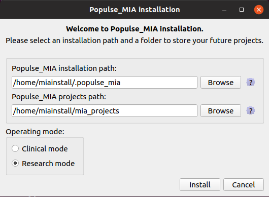
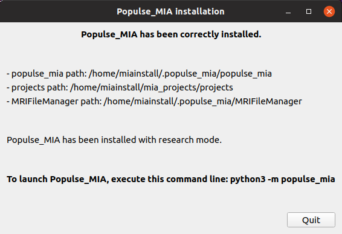

.. toctree::

+-----------------------+------------------------------------------------------+-------------------------------------+--------------------------------------------------+
|`Home <../index.html>`_|`Documentation <../documentation/documentation.html>`_|`Installation <./installation.html>`_|`GitHub <https://github.com/populse/populse_mia>`_|
+-----------------------+------------------------------------------------------+-------------------------------------+--------------------------------------------------+

Populse_MIA's user installation
===============================

This page explains how to install Populse_MIA.

Pre-requirements
----------------

* Make sure to have Python3 installed. You can verify it by typing the following in a command line: ::

        python3 -V

* Note: depending on your Python setup and OS, the "python3" command can be use as the default Python command. Try "python -V", if it returns "Python 3.x.x" replace all the "python3" commands below by "python".

Populse_MIA is ensured to work under Python's 3.5, 3.6 and 3.7 versions. 

* Make sure to have a java package installed. You can verify it by typing the following in a command line: ::

        java -version

* Make sure to have pip3 installed. You can verify it by typing the following in a command line: ::

        pip3 --version

* Make sure to have git installed. You can verify it by typing the following in a command line: ::

        git --version

* If you are installing Populse_MIA on Windows, make sure to have Microsoft Visual C++ installed.

Installation
------------

* First download the archive `here <https://github.com/dhrbn/populse_mia_install/archive/master.zip>`_.

* Unzip it and launch the following command in the extracted folder ("populse_mia_install-master"): ::

        python3 install_mia.py

* If PyQt5 and pyyaml are not installed in your Python environment they will be first installed before launching the Populse_MIA's installation. 

.. image:: ../images/mia_install_1.png
   :align: center
   :name: PyQt5 and pyyaml

|

* An error can sometimes occur, depending on your OS, after the installation of both packages, the Python environment not being correctly updated. If this error occurs launch the same command again to install Populse_MIA: ::

        python3 install_mia.py

|

* The Populse_MIA installation is now launched and you have to select three mandatory parameters:

    * Populse_MIA installation path: the folder where to install Populse_MIA, set by default to ".populse_mia" in the current user's diretory. Two folders will be created in the selected folder:
        * populse_mia: containing populse_mia's configuration and resources files.
        * MRIFileManager: containing the file converter used in Populse_MIA.

    * Populse_MIA projects path: the folder containing the analysis projects saved in Populse_MIA. A "projects" folder will be created in the selected folder.

    * Operating mode: Choose between clinical and research mode (more information about `operating mode <../documentation/documentation.html#operating-mode>`_).

* If you already want to configure the use of Matlab and SPM (in license or standalone mode), you can also specify these several paths:

    * Matlab path:
        * Path of the Matlab executable file (is detected automatically).

    * Matlab standalone path:
        * Path of the folder containing Matlab Compiler Runtine (e.g. /usr/local/MATLAB/MATLAB_Runtime/v93/).

    * SPM path:
        * Path of the folder containing SPM12 code.

    * SPM standalone path:
        * Path of the folder containing run_spm12.sh.

|

* Click on "Install" to install Populse_MIA with the selected parameters.

* The installation status is displayed. The last step (Python packages installation) may take a few minutes.

.. image:: ../images/mia_install_3.png
   :align: center
   :name: Populse_MIA install widget status

|

* When the packages have been installed, a summary of the installation is displayed.

|

* Populse_MIA is now installed. To launch it, type the following command: ::

        python3 -m populse_mia

